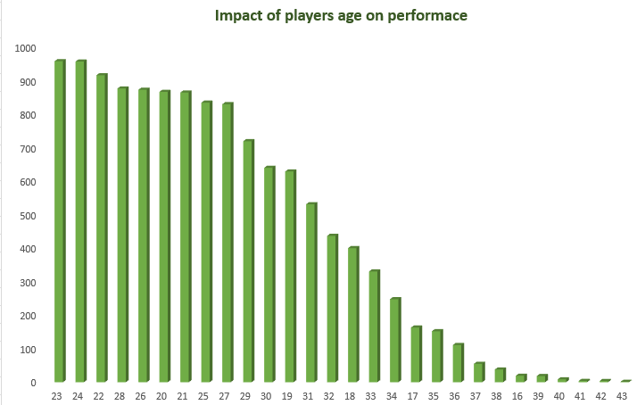
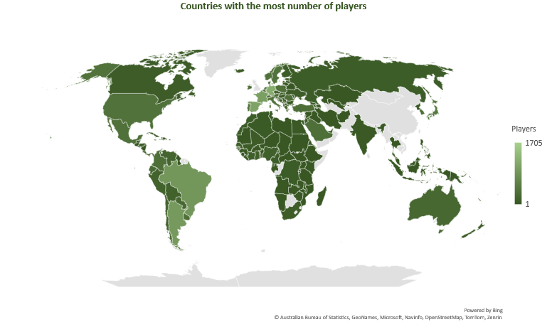
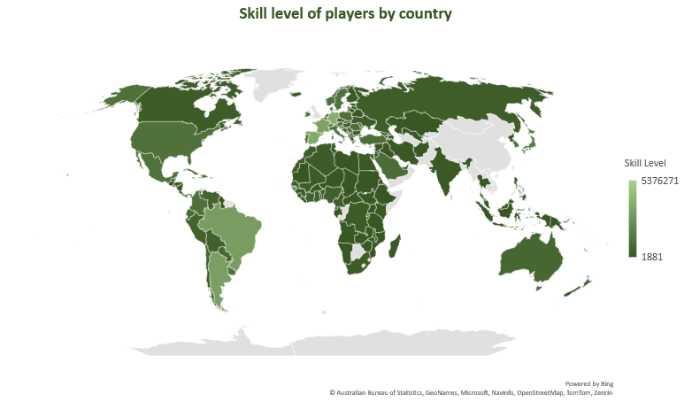
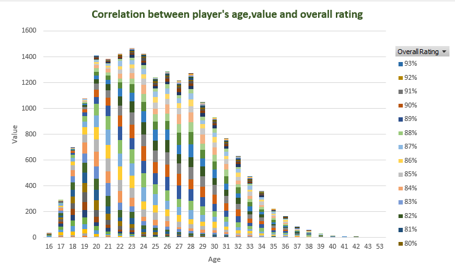

# FIFA-21 Data Analysis Report

## Background

This is a football data. The dataset was sourced from kaggle, it was obtained in its raw state after web scrapping from sofifa.com. One of the challenges of web scrapping is unclean data.
It contains the details of football players alongside their performance, updated up till 2021. It is worth noting that there are 18979 rows and 77 columns present in the dataset.

To acquire the dataset, click [here](https://www.kaggle.com/datasets/yagunnersya/fifa-21-messy-raw-dataset-for-cleaning-exploring) (look out for the image below)

## Data Cleaning and Pre-processing
The data cleaning was done using Microsoft excel and Power Query. The first step taken was to make a copy of the dataset so as to preserve the original.
The dataset had numerous issues that were fixed during the cleaning process. These issues include amongst others: 
- Data format errors
- Incorrect names
- Incorrect headers
- Special characters
- Missing entries
- Inconsistent values
- inconsistent units
- Incorrect IDs
- Duplicates
- Null values
- Hidden values
- Joined values
- Wrong symbols
- Spaces

The following Ms excel and Power query features were incorporated for Pre-processing, both individually and as combinations
- Delimiter
- Concat
- Substitue
- Text to columns
- Nested IFs
- Find
- Left
- Trunc
- Len
- Trim
- Clean
- Value
- Proper
- Whole number
- Find and replace
- Count
- Round
- Convert
- Split
- Date value
- Conditional formatting
- Filter
- Flashfill
- Text

Despite the challenges encountered, the dataset was transformed and ready for use in analysis.

PS: The data cleaning methods was documented for readers who may want to replicate my processes or evaluate my results.

## Data Analysis
My objective for the analysis was performance, age, salary, country and correlation.

- Performance analysis: I used the performance information to analyze the performance of individual players and teams. This involved looking at metrics such as goals scored, assists, shots on target, pass accuracy, tackles, attacking, crossing, finishing, heading accuracy, shots passing, long passing, dribbling, ball control, movement, acceleration, sprint speed, agility, reactions, balance, power, shot power, jumping, stamina, strenght, long shots, mentality, aggression, interceptions, positioning , vision, penalities, compulsion, defending, marking, goal keeping, G handling, G diving, g positioning, G kicking, GK reflexes, hits, overall rating and interceptions etc
 This analysis can be used to identify the best performing players and teams.

- Salary analysis: I used the wage data to analyze the salaries of individual players in various teams. This involved looking at metrics such as average salary, salary distribution, and salary trends over time. I also used this information to identify the highest paid players and to compare salaries across different variables.

- Age analysis: I used the age data to analyze the age distribution of players. This involved looking at metrics such as average age, age distribution, and age trends over time. I also used this information to identify the average age of players accross teams, compare age distributions across competitions and get insights on the impact of age on performance.
- 
Impact of age on Performance |  Average age
:-------------------------:  | :--------------:
              
 

- Country analysis: I used the country data to analyze the nationality of players and teams. This involved looking at metrics such as the number of players from
each country, the distribution of players across different positions, and the performance of players from different countries. I also used this information to identify trends in player nationality over time, and to compare the performance of players from different countries.

Countries with most players | Skill level of players by country
:-----------------------:   | :--------------------------------:
                  

- Correlation analysis: I used statistical techniques such as correlation analysis to identify relationships between different variables in the dataset. For example, I analyzed the relationship between player age and performance, players value and overall rating. This could help you identify factors that influence player performance or salary, and could inform player selection and team strategy.

The interactive dashboard will give you more insights to the analysis reviewed. You can interact with the report [here](https://introanalyst-my.sharepoint.com/:x:/g/personal/preyefiyai_introanalyst_onmicrosoft_com/EZpTUGIMuS9Crbv57uqWGmgBlbWjLfuJVpWRN3R5i3-RDg?e=UVwrcj)

## Conclusion
The project demonstrate the power of data analysis and technology in helping individuals and organisations gain relevant insights. I hope this inspires you to use data analysis techniques to optimise decision making.
